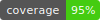

[](https://pypi.org/project/zanj/)
[](https://github.com/mivanit/zanj/actions/workflows/checks.yml)
[](docs/coverage/coverage.txt)


<!-- 
 -->
<!--  -->

# ZANJ

# Overview

The `ZANJ` format is meant to be a way of saving arbitrary objects to disk, in a way that is flexible, allows keeping configuration and data together, and is human readable. It is very loosely inspired by HDF5 and the derived `exdir` format, and the implementation is inspired by `npz` files.

- You can take any `SerializableDataclass` from the [muutils](https://github.com/mivanit/muutils) library and save it to disk -- any large arrays or lists will be stored efficiently as external files in the zip archive, while the basic structure and metadata will be stored in readable JSON files. 
- You can also specify a special `ConfiguredModel`, which inherits from a `torch.nn.Module` which will let you save not just your model weights, but all required configuration information, plus any other metadata (like training logs) in a single file.

This library was originally a module in [muutils](https://github.com/mivanit/muutils/)


# Installation
Available on PyPI as [`zanj`](https://pypi.org/project/zanj/)

```
pip install zanj
```

# Usage

You can find a runnable example of this in [`demo.ipynb`](demo.ipynb)

## Saving a basic object

Any `SerializableDataclass` of basic types can be saved as zanj:

```python
import numpy as np
import pandas as pd
from muutils.json_serialize import SerializableDataclass, serializable_dataclass, serializable_field
from zanj import ZANJ

@serializable_dataclass
class BasicZanj(SerializableDataclass):
    a: str
    q: int = 42
    c: list[int] = serializable_field(default_factory=list)

# initialize a zanj reader/writer
zj = ZANJ()

# create an instance
instance: BasicZanj = BasicZanj("hello", 42, [1, 2, 3])
path: str = "tests/junk_data/path_to_save_instance.zanj"
zj.save(instance, path)
recovered: BasicZanj = zj.read(path)
```

ZANJ will intelligently handle nested serializable dataclasses, numpy arrays, pytorch tensors, and pandas dataframes: 

```python
import torch
import pandas as pd

@serializable_dataclass
class Complicated(SerializableDataclass):
    name: str
    arr1: np.ndarray
    arr2: np.ndarray
    iris_data: pd.DataFrame
    brain_data: pd.DataFrame
    container: list[BasicZanj]
    torch_tensor: torch.Tensor
```

For custom classes, you can specify a `serialization_fn` and `loading_fn` to handle the logic of converting to and from a json-serializable format:

```python
@serializable_dataclass
class Complicated(SerializableDataclass):
    name: str
    device: torch.device = serializable_field(
        serialization_fn=lambda self: str(self.device),
        loading_fn=lambda data: torch.device(data["device"]),
    )
```

Note that `loading_fn` takes the dictionary of the whole class -- this is in case you've stored data in multiple fields of the dict which are needed to reconstruct the object.

## Saving Models

First, define a configuration class for your model. This class will hold the parameters for your model and any associated objects (like losses and optimizers). The configuration class should be a subclass of `SerializableDataclass` and use the `serializable_field` function to define fields that need special serialization.

Here's an example that defines a GPT-like model configuration:

```python
from zanj.torchutil import ConfiguredModel, set_config_class

@serializable_dataclass
class MyNNConfig(SerializableDataclass):
    input_dim: int
    hidden_dim: int
    output_dim: int

    # store the activation function by name, reconstruct it by looking it up in torch.nn
    act_fn: torch.nn.Module = serializable_field(
        serialization_fn=lambda x: x.__name__,
        loading_fn=lambda x: getattr(torch.nn, x["act_fn"]),
    )

    # same for the loss function
    loss_kwargs: dict = serializable_field(default_factory=dict)
    loss_factory: torch.nn.modules.loss._Loss = serializable_field(
        default_factory=lambda: torch.nn.CrossEntropyLoss,
        serialization_fn=lambda x: x.__name__,
        loading_fn=lambda x: getattr(torch.nn, x["loss_factory"]),
    )
    loss = property(lambda self: self.loss_factory(**self.loss_kwargs))
```

Then, define your model class. It should be a subclass of `ConfiguredModel`, and use the `set_config_class` decorator to associate it with your configuration class. The `__init__` method should take a single argument, which is an instance of your configuration class. You must also call the superclass `__init__` method with the configuration instance.

```python
@set_config_class(MyNNConfig)
class MyNN(ConfiguredModel[MyNNConfig]):
    def __init__(self, config: MyNNConfig):
		# call the superclass init!
		# this will store the model in the zanj_model_config field
        super().__init__(config)

		# whatever you want here
        self.net = torch.nn.Sequential(
            torch.nn.Linear(config.input_dim, config.hidden_dim),
            config.act_fn(),
            torch.nn.Linear(config.hidden_dim, config.output_dim),
        )

    def forward(self, x):
        return self.net(x)
```

You can now create instances of your model, save them to disk, and load them back into memory:

```python
config = MyNNConfig(
    input_dim=10,
    hidden_dim=20,
    output_dim=2,
    act_fn=torch.nn.ReLU,
    loss_kwargs=dict(reduction="mean"),
)

# create your model from the config, and save
model = MyNN(config)
fname = "tests/junk_data/path_to_save_model.zanj"
ZANJ().save(model, fname)
# load by calling the class method `read()`
loaded_model = MyNN.read(fname)
# zanj will actually infer the type of the object in the file 
# -- and will warn you if you don't have the correct package installed
loaded_another_way = ZANJ().read(fname)
```

## Configuration

When initializing a `ZANJ` object, you can specify some configuration info about saving, such as:

- thresholds for how big an array/table has to be before moving to external file
- compression settings
- error modes
- additional handlers for serialization

```python
# how big an array or list (including pandas DataFrame) can be before moving it from the core JSON file
external_array_threshold: int = ZANJ_GLOBAL_DEFAULTS.external_array_threshold
external_list_threshold: int = ZANJ_GLOBAL_DEFAULTS.external_list_threshold
# compression settings passed to `zipfile` package
compress: bool | int = ZANJ_GLOBAL_DEFAULTS.compress
# for doing very cursed things in your own custom loading or serialization functions
custom_settings: dict[str, Any] | None = ZANJ_GLOBAL_DEFAULTS.custom_settings
# specify additional serialization handlers
handlers_pre: MonoTuple[SerializerHandler] = tuple()
handlers_default: MonoTuple[SerializerHandler] = DEFAULT_SERIALIZER_HANDLERS_ZANJ,
```

# Implementation

The on-disk format is a file `<filename>.zanj` is a zip file containing:

- `__zanj_meta__.json`: a file containing zanj-specific metadata including:
	- system information
	- installed packages
	- information about external files
- `__zanj__.json`: a file containing user-specified data
	- when an element is too big, it can be moved to an external file
		- `.npy` for numpy arrays or torch tensors
		- `.jsonl` for pandas dataframes or large sequences
	- list of external files stored in `__zanj_meta__.json`
	- "$ref" key will have value pointing to external file
	- `__format__` key will detail an external format type


# Comparison to other formats


| Format                  | Safe | Zero-copy | Lazy loading | No file size limit | Layout control | Flexibility | Bfloat16 |
| ----------------------- | ---- | --------- | ------------ | ------------------ | -------------- | ----------- | -------- |
| pickle (PyTorch)        | ❌   | ❌        | ❌           | ✅                 | ❌             | ✅          | ✅       |
| H5 (Tensorflow)         | ✅   | ❌        | ✅           | ✅                 | ~              | ~           | ❌       |
| HDF5                    | ✅   | ?         | ✅           | ✅                 | ~              | ✅          | ❌       |
| SavedModel (Tensorflow) | ✅   | ❌        | ❌           | ✅                 | ✅             | ❌          | ✅       |
| MsgPack (flax)          | ✅   | ✅        | ❌           | ✅                 | ❌             | ❌          | ✅       |
| Protobuf (ONNX)         | ✅   | ❌        | ❌           | ❌                 | ❌             | ❌          | ✅       |
| Cap'n'Proto             | ✅   | ✅        | ~            | ✅                 | ✅             | ~           | ❌       |
| Numpy (npy,npz)         | ✅   | ?         | ?            | ❌                 | ✅             | ❌          | ❌       |
| SafeTensors             | ✅   | ✅        | ✅           | ✅                 | ✅             | ❌          | ✅       |
| exdir                   | ✅   | ?         | ?            | ?                  | ?              | ✅          | ❌       |
| ZANJ                    | ✅   | ❌        | ❌*          | ✅                 | ✅             | ✅          | ❌*      |


- Safe: Can I use a file randomly downloaded and expect not to run arbitrary code ?
- Zero-copy: Does reading the file require more memory than the original file ?
- Lazy loading: Can I inspect the file without loading everything ? And loading only some tensors in it without scanning the whole file (distributed setting) ?
- Layout control: Lazy loading, is not necessarily enough since if the information about tensors is spread out in your file, then even if the information is lazily accessible you might have to access most of your file to read the available tensors (incurring many DISK -> RAM copies). Controlling the layout to keep fast access to single tensors is important.
- No file size limit: Is there a limit to the file size ?
- Flexibility: Can I save custom code in the format and be able to use it later with zero extra code ? (~ means we can store more than pure tensors, but no custom code)
- Bfloat16: Does the format support native bfloat16 (meaning no weird workarounds are necessary)? This is becoming increasingly important in the ML world.

`*` denotes this feature may be coming at a future date :)

(This table was stolen from [safetensors](https://github.com/huggingface/safetensors/blob/main/README.md))
